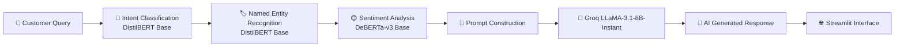

<!-- ========================================================================================= -->
<!--                                         HEADER                                             -->
<!-- ========================================================================================= -->

<h1 align="center">
🤖 AI-Powered E-Commerce Chatbot
</h1>

<h3 align="center">
An Intelligent Multi-Model Conversational AI System for Automated E-Commerce Customer Support
</h3>

<p align="center">


</p>

---

<p align="center">

### 🚀 Live Demo

### https://e-commerce-chatbotdbewhjbfebfuewgfiw.streamlit.app

</p>

---

## 📌 Overview

Modern e-commerce platforms receive thousands of customer queries every day regarding **orders, refunds, cancellations, shipping, payments, returns, product information, and account-related issues**. Providing accurate, personalized, and timely support at scale remains one of the biggest challenges for online businesses.

Traditional rule-based chatbots rely heavily on predefined rules, keyword matching, and static response templates. These systems often struggle to understand natural language, identify the actual intent behind customer queries, extract important contextual information, recognize customer sentiment, and generate meaningful responses for complex conversations.

This project presents an **AI-Powered E-Commerce Chatbot** that combines **multiple Transformer-based NLP models** with a **Large Language Model (LLM)** to create a production-oriented conversational AI system capable of delivering intelligent, context-aware, and human-like customer support.

Instead of relying on a single model, the chatbot follows a **multi-stage NLP pipeline**, where specialized deep learning models collaborate to understand user queries before generating responses.

The conversational pipeline integrates:

- 🎯 **Intent Classification** using DistilBERT Base
- 🏷️ **Named Entity Recognition (NER)** using DistilBERT Base
- 😊 **Sentiment Analysis** using DeBERTa-v3 Base
- 🧠 **Response Generation** using Groq's LLaMA-3.1-8B-Instant
- 🌐 **Interactive Web Interface** using Streamlit

The resulting system provides a scalable and modular architecture that improves customer support efficiency while enhancing the overall customer experience.

---

# 🎯 Problem Statement

E-commerce companies receive a high volume of customer inquiries related to orders, shipping, returns, refunds, payments, account management, and product information. Traditional customer support systems, including rule-based chatbots, often fail to understand natural language, accurately identify customer intent, extract critical information, recognize customer sentiment, and generate context-aware responses.

These limitations lead to repetitive interactions, delayed issue resolution, inconsistent customer experiences, increased workload for customer support teams, and higher operational costs. Consequently, customers experience frustration and reduced satisfaction, while businesses struggle to provide efficient and personalized support at scale.

This project addresses these challenges by developing an **AI-powered conversational customer support system** that combines transformer-based Natural Language Processing (NLP) models with a Large Language Model (LLM). The system intelligently understands customer queries, extracts relevant entities, analyzes customer sentiment, and generates personalized, context-aware responses to improve communication between customers and e-commerce businesses.

---

# 🎯 Goal

To develop a production-ready AI-powered conversational assistant for e-commerce customer support that leverages transformer-based Natural Language Processing models and a Large Language Model to automate customer interactions through intelligent query understanding, contextual information extraction, sentiment-aware analysis, and human-like response generation.

---

# 🎯 Project Objectives

- Develop an accurate **Intent Classification** model using DistilBERT Base.
- Build a robust **Named Entity Recognition (NER)** model for extracting critical information from customer queries.
- Implement **Sentiment Analysis** using DeBERTa-v3 Base to understand customer emotions.
- Generate context-aware and personalized responses using Groq's LLaMA-3.1-8B-Instant.
- Reduce dependence on manual customer support.
- Improve communication between customers and businesses.
- Design a modular and scalable NLP architecture.
- Provide a deployment-ready AI solution using Streamlit and Hugging Face.

---

# ✨ Key Features

- 🤖 Intelligent conversational AI
- 🎯 Transformer-based Intent Classification
- 🏷️ Named Entity Recognition
- 😊 Sentiment-aware conversations
- 🧠 LLM-powered dynamic response generation
- ⚡ Ultra-fast inference using Groq API
- ☁️ Hugging Face model hosting
- 🌐 Streamlit web application
- 🔐 Secure environment variable management
- 📦 Modular architecture
- 🚀 Deployment-ready design

---

# 📚 Table of Contents

- Overview
- Problem Statement
- Goal
- Objectives
- Features
- System Architecture
- AI Pipeline
- Model Details
- Technology Stack
- Project Structure
- Installation
- Usage
- Live Demo
- Deployment
- Future Improvements
- Contributing
- License
- Author

---

# 🏗️ System Architecture

The chatbot follows a **modular multi-stage Natural Language Processing (NLP) pipeline**, where each model performs a specialized task before passing structured information to the next stage. This design enables accurate query understanding, contextual reasoning, and human-like response generation.



---

# 🔄 End-to-End AI Pipeline

The chatbot processes every customer query through a sequence of specialized AI models before generating the final response.

```
Customer Query
      │
      ▼
────────────────────────────────────
Intent Classification
────────────────────────────────────
      │
      ▼
────────────────────────────────────
Named Entity Recognition
────────────────────────────────────
      │
      ▼
────────────────────────────────────
Sentiment Analysis
────────────────────────────────────
      │
      ▼
────────────────────────────────────
Groq LLaMA-3.1-8B-Instant
────────────────────────────────────
      │
      ▼
────────────────────────────────────
AI Generated Response
────────────────────────────────────
```

---

# 🧠 AI Workflow

### Step 1 — Customer Query

The customer submits a natural language query through the Streamlit interface.

**Example**

```
I want to cancel my order #458963 because it hasn't shipped yet.
```

---

### Step 2 — Intent Classification

The query is first passed to the **fine-tuned DistilBERT Intent Classification model**, which determines the primary objective of the customer.

Example Output

```
Intent

Cancel Order
```

---

### Step 3 — Named Entity Recognition

The same customer query is processed by the **DistilBERT Named Entity Recognition model**.

The model extracts structured information such as:

- Order Number
- Product Name
- Customer Name
- Shipping Address
- Refund Amount
- Date
- Payment Method

Example

Input

```
Cancel my order #458963
```

Output

```
Order Number → 458963
```

---

### Step 4 — Sentiment Analysis

The customer message is analyzed using the **DeBERTa-v3 Base Sentiment Analysis model**.

Possible predictions:

- Positive
- Neutral
- Negative

This information enables the chatbot to produce responses that better match the customer's emotional state.

Example

```
"I'm really frustrated because my refund hasn't arrived."

↓

Negative
```

---

### Step 5 — Prompt Construction

Outputs from all NLP models are merged into a structured context.

Example

```
Intent

Cancel Order

Entities

Order Number : 458963

Sentiment

Negative

Customer Query

I want to cancel my order #458963 because it hasn't shipped yet.
```

This structured information is supplied to the Large Language Model.

---

### Step 6 — Response Generation

The chatbot sends the enriched prompt to

> **Groq LLaMA-3.1-8B-Instant**

The LLM generates a personalized, natural, and context-aware response instead of relying on predefined templates.

Example

```
I understand that you would like to cancel Order #458963.

If your order has not yet been shipped, it is generally eligible for cancellation and a full refund. Please confirm if you would like to proceed with the cancellation request.
```

---

### Step 7 — Response Delivery

The generated response is displayed instantly through the Streamlit web application.

The user experiences a seamless, conversational interaction similar to communicating with a human customer support representative.

---

# 🤖 Machine Learning Models

This project follows a **specialized multi-model architecture**, where each model is responsible for solving a specific Natural Language Processing task.

| Model | Task | Purpose |
|---------|------|----------|
| DistilBERT Base | Intent Classification | Understand customer request |
| DistilBERT Base | Named Entity Recognition | Extract structured information |
| DeBERTa-v3 Base | Sentiment Analysis | Detect customer emotions |
| LLaMA-3.1-8B-Instant | Response Generation | Generate contextual responses |

---

# 🎯 Intent Classification

### Model

```
DistilBERT Base
```

### Purpose

Identify the customer's primary objective from natural language.

### Supported Intent Categories

- Track Order
- Cancel Order
- Return Product
- Refund Request
- Payment Issues
- Product Information
- Change Address
- Delivery Status
- Account Related Queries
- General Customer Support

The output of this model determines the direction of the remaining NLP pipeline.

---

# 🏷️ Named Entity Recognition (NER)

### Model

```
DistilBERT Base
```

### Purpose

Automatically identify important business entities within customer conversations.

Examples include:

- Order Number
- Product Name
- Customer Name
- Delivery Address
- Account Number
- Refund Amount
- Currency
- Date
- Phone Number

These extracted entities provide structured context for the LLM.

---

# 😊 Sentiment Analysis

### Model

```
DeBERTa-v3 Base
```

### Purpose

Determine the emotional tone of customer messages.

Output Classes

- Positive
- Neutral
- Negative

By understanding customer sentiment, the chatbot produces more empathetic and contextually appropriate responses.

---

# 🧠 Response Generation

### Model

```
Groq LLaMA-3.1-8B-Instant
```

Unlike traditional chatbots that rely on predefined rules or response templates, this project uses a Large Language Model to generate dynamic responses.

The LLM receives:

- Original customer query
- Predicted intent
- Extracted entities
- Customer sentiment

and produces a coherent, personalized, and context-aware response.

---

# 💡 Why a Multi-Model Architecture?

Instead of relying on a single model to solve every task, this project separates Natural Language Understanding into specialized components.

### Advantages

- Higher intent prediction accuracy
- Better entity extraction
- Emotion-aware conversations
- More informative prompts for the LLM
- Improved response quality
- Easier model maintenance and upgrades
- Independent retraining of individual models
- Scalable production architecture

This modular design closely resembles modern enterprise conversational AI systems used in production environments.

---

# ⚙️ Technology Stack

The chatbot is built using a modern AI and web development stack that combines transformer-based NLP models, a Large Language Model (LLM), and a lightweight web interface.

## Programming Language

- **Python 3.10+**

---

## Frontend

- **Streamlit** — Interactive web application for chatbot interaction.

---

## Deep Learning Framework

- **PyTorch** — Training and inference for transformer models.

---

## Natural Language Processing

- **Hugging Face Transformers** — Loading, fine-tuning, and inference of pretrained transformer models.

---

## Machine Learning Models

| Model | Task |
|--------|------|
| DistilBERT Base | Intent Classification |
| DistilBERT Base | Named Entity Recognition |
| DeBERTa-v3 Base | Sentiment Analysis |
| LLaMA-3.1-8B-Instant (Groq API) | Response Generation |

---

## Model Hosting

- Hugging Face Hub

---

## LLM Provider

- Groq API

---

## Environment Management

- python-dotenv

---

## Development Environment

- Visual Studio Code

---

# 📂 Project Structure

```
E-commerce-Chatbot/
│
├── app.py                         # Streamlit application
├── requirements.txt               # Project dependencies
├── README.md                      # Project documentation
├── .env                           # Environment variables (not committed)
│
├── src/
│   ├── chatbot.py                 # Main chatbot orchestration pipeline
│   ├── groq_client.py             # Groq API integration
│   ├── intent_classifier.py       # Intent prediction module
│   ├── ner.py                     # Named Entity Recognition module
│   ├── sentiment.py               # Sentiment analysis module
│   ├── preprocessing.py           # Text preprocessing
│   ├── prompt_builder.py          # Prompt engineering
│   ├── config.py                  # Configuration settings
│   └── utils.py                   # Utility functions
│
├── assets/
│   ├── chatbot_ui.png             # Application screenshots
│   └── architecture.png           # Architecture diagram
│
└── models/
    └── (Loaded directly from Hugging Face Hub)
```

> **Note:** The transformer models are hosted on **Hugging Face Hub** and downloaded automatically during inference, keeping the repository lightweight.

---

# 🚀 Installation

## 1. Clone the Repository

```bash
git clone https://github.com/Shashank123-wq-tech/E-commerce-Chatbot.git

cd E-commerce-Chatbot
```

---

## 2. Create a Virtual Environment

### Windows

```bash
python -m venv venv

venv\Scripts\activate
```

### Linux / macOS

```bash
python3 -m venv venv

source venv/bin/activate
```

---

## 3. Upgrade pip

```bash
python -m pip install --upgrade pip
```

---

## 4. Install Dependencies

```bash
pip install -r requirements.txt
```

---

# 📦 Requirements

```text
# Streamlit
streamlit>=1.35.0

# Numpy — must be installed before torch
numpy==1.26.4

# PyTorch CPU only (Streamlit Cloud has no GPU)
--extra-index-url https://download.pytorch.org/whl/cpu
torch==2.2.0+cpu
torchvision==0.17.0+cpu

# HuggingFace
transformers==4.40.0
huggingface_hub>=0.23.0
accelerate>=0.30.0
tokenizers>=0.19.0
sentencepiece>=0.2.0
protobuf>=3.20.0 

# Groq
groq>=0.9.0

# Utilities
python-dotenv>=1.0.0
```

---

# 🔐 Environment Variables

Create a `.env` file in the project root directory.

```env
GROQ_API_KEY=your_groq_api_key

HF_TOKEN=your_huggingface_access_token
```

> **Important:** Never commit your `.env` file or API keys to the repository.

---

# 🤗 Hugging Face Model Hosting

The fine-tuned transformer models used in this project are hosted on **Hugging Face Hub**.

During application startup, the models are automatically downloaded and cached locally, ensuring:

- Lightweight GitHub repository
- Simplified deployment
- Easy model updates
- Version-controlled model management

The project loads the following models:

- DistilBERT Intent Classification Model
- DistilBERT Named Entity Recognition Model
- DeBERTa-v3 Sentiment Analysis Model

---

# 🧠 Groq LLM Integration

The chatbot uses **Groq's LLaMA-3.1-8B-Instant** model for response generation.

The LLM receives:

- Customer Query
- Predicted Intent
- Extracted Entities
- Customer Sentiment

and generates a context-aware, personalized response in real time.

---

# ▶️ Running the Application

Launch the Streamlit application:

```bash
streamlit run app.py
```

After the application starts successfully, open your browser and navigate to:

```
http://localhost:8501
```

---

# 💻 How to Use

### Step 1

Enter a customer query into the chatbot.

Example:

```
I want to cancel my order #458963.
```

---

### Step 2

The chatbot processes the query using:

- Intent Classification
- Named Entity Recognition
- Sentiment Analysis

---

### Step 3

The processed information is combined into a structured prompt.

---

### Step 4

The prompt is sent to Groq's LLaMA-3.1-8B-Instant model.

---

### Step 5

A personalized, context-aware response is generated and displayed in the Streamlit interface.

---

# 🌐 Live Demo

The application is publicly deployed on **Streamlit Community Cloud**.

**Live Application:**

👉 **https://e-commerce-chatbotdbewhjbfebfuewgfiw.streamlit.app**

---

# ☁️ Deployment

This project is deployment-ready and can be hosted on:

- ✅ Streamlit Community Cloud
- ✅ Hugging Face Spaces
- ✅ Local Machine
- ✅ Docker (Future Enhancement)
- ✅ AWS EC2
- ✅ Google Cloud Run
- ✅ Microsoft Azure

The current deployment uses:

- **Frontend:** Streamlit Community Cloud
- **Model Hosting:** Hugging Face Hub
- **LLM Backend:** Groq API

---

# 📸 Application Preview

> **Note:** Add screenshots of your application after deployment to showcase the user interface and chatbot workflow.

## Home Interface

<p align="center">

</p>

---

## Chat Interface

<p align="center">

</p>

---

## Example Conversation

**User Query**

```text
I ordered the wrong size yesterday. Can you cancel my order #458963 before it ships?
```

### NLP Pipeline Output

**Intent**

```text
Cancel Order
```

**Named Entities**

```text
Order Number → 458963
```

**Sentiment**

```text
Negative
```

### AI Response

```text
I understand that you'd like to cancel Order #458963.

If your order has not been shipped yet, it is generally eligible for cancellation. Please confirm that you would like to proceed with the cancellation request.
```

---

# 🔍 Supported Customer Queries

The chatbot is designed to handle a wide variety of customer support requests commonly encountered in e-commerce platforms.

### Order Management

- Order Tracking
- Order Cancellation
- Order Modification
- Delivery Status

### Returns & Refunds

- Return Requests
- Refund Status
- Exchange Requests

### Product Assistance

- Product Information
- Product Availability
- Product Issues

### Shipping & Delivery

- Shipping Address Change
- Delivery Delays
- Shipping Information

### Payment Support

- Payment Issues
- Failed Transactions
- Billing Queries

### Account Support

- Account Information
- Profile Updates
- General Customer Assistance

---

# 🧩 Design Principles

This project was designed with a focus on modularity, scalability, and maintainability.

### Modular Architecture

Each NLP task is handled by an independent model, allowing components to be updated or retrained without affecting the rest of the system.

### Separation of Responsibilities

Each module performs a single responsibility:

- Intent Classification
- Named Entity Recognition
- Sentiment Analysis
- Prompt Construction
- Response Generation

This improves readability, maintainability, and extensibility.

### Lightweight Repository

Rather than storing large model files inside the repository, all fine-tuned models are hosted on Hugging Face Hub and loaded dynamically during application startup.

### Secure Configuration

Sensitive credentials such as API keys are managed using environment variables via `.env`, ensuring they are never exposed in source control.

---

# 📌 Current Capabilities

✔ Natural language understanding for customer queries

✔ Intent detection using a fine-tuned transformer model

✔ Automatic extraction of important entities

✔ Sentiment-aware customer interaction

✔ Context-aware response generation

✔ Interactive web interface

✔ Cloud-hosted NLP models

✔ Real-time LLM inference through Groq API

---

# 🚀 Future Enhancements

The current implementation provides a strong foundation for an intelligent customer support assistant. Future improvements may include:

### Retrieval-Augmented Generation (RAG)

Integrate a vector database to retrieve information from product catalogs, FAQs, company policies, and order records before generating responses.

---

### Multi-turn Conversation Memory

Maintain conversation history to support follow-up questions and long-running customer interactions.

---

### Real-time Database Integration

Connect with e-commerce databases to enable live:

- Order Tracking
- Order Cancellation
- Refund Status
- Inventory Lookup

---

### Authentication & User Accounts

Allow authenticated users to securely access their own order history and account information.

---

### Voice-enabled Customer Support

Enable speech-to-text and text-to-speech capabilities for voice-based interactions.

---

### Multilingual Support

Expand the chatbot to support multiple languages for global e-commerce platforms.

---

### Analytics Dashboard

Provide business insights such as:

- Frequently asked questions
- Common customer intents
- Sentiment trends
- Support workload analysis

---

### Containerization

Package the application using Docker for simplified deployment across cloud environments.

---

### CI/CD Pipeline

Implement automated testing and deployment workflows using GitHub Actions.

---

# 🤝 Contributing

Contributions are welcome!

If you'd like to improve this project, feel free to:

1. Fork the repository.
2. Create a new feature branch.

```bash
git checkout -b feature/your-feature-name
```

3. Commit your changes.

```bash
git commit -m "Add your feature"
```

4. Push your branch.

```bash
git push origin feature/your-feature-name
```

5. Open a Pull Request.

Please ensure that your contributions follow clean coding practices and include appropriate documentation where necessary.

---

# 💡 Learning Outcomes

This project demonstrates practical implementation of:

- Transformer-based Natural Language Processing
- Intent Classification
- Named Entity Recognition
- Sentiment Analysis
- Prompt Engineering
- Large Language Model Integration
- API-based AI Applications
- Streamlit Deployment
- Hugging Face Model Hosting
- Modular AI System Design

---

# 📚 References

This project builds upon concepts and technologies from:

- Hugging Face Transformers
- PyTorch
- Streamlit
- Groq API
- Natural Language Processing (NLP)
- Large Language Models (LLMs)
- Prompt Engineering
- Transformer-based Deep Learning

---

# 🙏 Acknowledgements

Special thanks to the open-source AI community and the organizations that make modern AI development accessible:

- Hugging Face
- Groq
- PyTorch
- Streamlit
- The Open Source Machine Learning Community

---

---

# 📄 License

This project is licensed under the **MIT License**.

You are free to use, modify, and distribute this project in accordance with the terms of the license.

For more details, see the **LICENSE** file in this repository.

---

# 🔒 Security

To protect sensitive credentials and ensure secure deployment:

- API keys are managed using environment variables (`.env`).
- The `.env` file is excluded from version control using `.gitignore`.
- Fine-tuned models are hosted on **Hugging Face Hub** rather than stored directly in the repository.
- No sensitive information or credentials are included in this repository.

---

# 📌 Repository Information

| Item | Details |
|------|---------|
| **Project** | AI-Powered E-Commerce Chatbot |
| **Domain** | Natural Language Processing (NLP) |
| **Application** | Intelligent Customer Support |
| **Architecture** | Multi-Model NLP + Large Language Model |
| **Frontend** | Streamlit |
| **Backend** | Python |
| **Deep Learning Framework** | PyTorch |
| **Transformer Library** | Hugging Face Transformers |
| **Model Hosting** | Hugging Face Hub |
| **LLM Provider** | Groq |
| **Deployment** | Streamlit Community Cloud |

---

# 📈 Project Roadmap

The project will continue to evolve with additional features and improvements.

### Version 1.0 (Current)

- ✅ Intent Classification
- ✅ Named Entity Recognition
- ✅ Sentiment Analysis
- ✅ Groq LLM Integration
- ✅ Prompt Engineering
- ✅ Streamlit Deployment
- ✅ Hugging Face Model Hosting

---

### Version 2.0 (Planned)

- 🔄 Retrieval-Augmented Generation (RAG)
- 🔄 Product Catalog Search
- 🔄 Company Knowledge Base Integration
- 🔄 Conversation Memory
- 🔄 Database Connectivity
- 🔄 Real-Time Order Tracking
- 🔄 User Authentication
- 🔄 Docker Support
- 🔄 REST API
- 🔄 Admin Dashboard

---

# 🛠️ Built With

This project was developed using the following technologies:

- Python
- PyTorch
- Hugging Face Transformers
- DistilBERT Base
- DeBERTa-v3 Base
- Groq API
- LLaMA-3.1-8B-Instant
- Streamlit
- Hugging Face Hub
- Git
- GitHub

---

# 👨‍💻 Author

## Shashank Dixit

**AI & Machine Learning Enthusiast**

Passionate about building intelligent systems using:

- Artificial Intelligence
- Machine Learning
- Deep Learning
- Natural Language Processing
- Large Language Models
- Generative AI
- MLOps
- AI Applications

---

### GitHub

https://github.com/Shashank123-wq-tech

---

### Project Repository

https://github.com/Shashank123-wq-tech/E-commerce-Chatbot

---

### Live Demo

https://e-commerce-chatbotdbewhjbfebfuewgfiw.streamlit.app

---

# 🤝 Connect & Feedback

If you have suggestions, feedback, or ideas for improving this project, feel free to:

- Open an Issue
- Submit a Pull Request
- Start a Discussion
- Share your feedback

Constructive contributions and discussions are always welcome.

---

# ⭐ Support the Project

If you found this project useful or learned something from it:

- ⭐ Star this repository
- 🍴 Fork the repository
- 📢 Share it with others
- 💡 Contribute new ideas and improvements

Your support helps motivate further development and encourages open-source collaboration.

---

# 📚 Final Notes

This project demonstrates the practical integration of multiple transformer-based NLP models with a Large Language Model to build an intelligent conversational AI system for e-commerce customer support.

By combining **Intent Classification**, **Named Entity Recognition**, **Sentiment Analysis**, and **LLM-powered Response Generation**, the chatbot provides a modular, scalable, and production-oriented architecture capable of delivering contextual, human-like customer interactions.

The project serves as both a practical implementation of modern NLP techniques and a foundation for developing next-generation AI-powered customer support solutions.

---

<div align="center">

## ⭐ If you found this project helpful, please consider giving it a Star!

### Thank you for visiting this repository.

**Happy Coding! 🚀**

</div>
